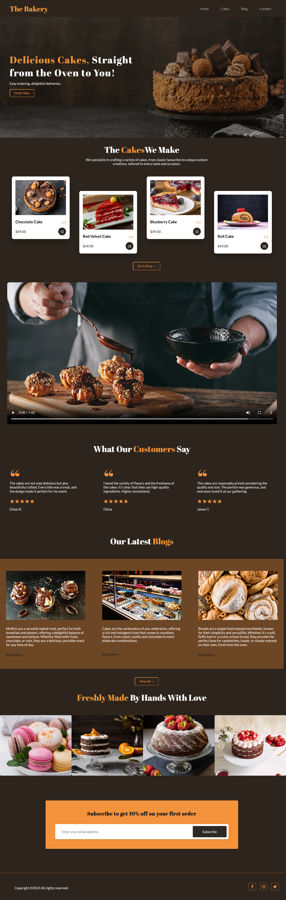

# Bakery Landing Page

A simple bakery landing page built using HTML and CSS.  
This project focuses on implementing a clean layout and basic responsiveness based on a Figma design.

## Features
- Structured HTML layout
- CSS styling for modern UI
- Responsive design for different screen sizes
- Navigation bar, hero section, and content sections

## Technologies Used
- HTML5
- CSS3

## Screenshot

## What I Learned
- How to convert a Figma design into code
- Using Flexbox for layout design
- Basics of responsive web design
- Improving UI structure and spacing

## Notes
- Design inspired by a Figma layout (not originally created by me)
- This project was built for learning and practice purposes
